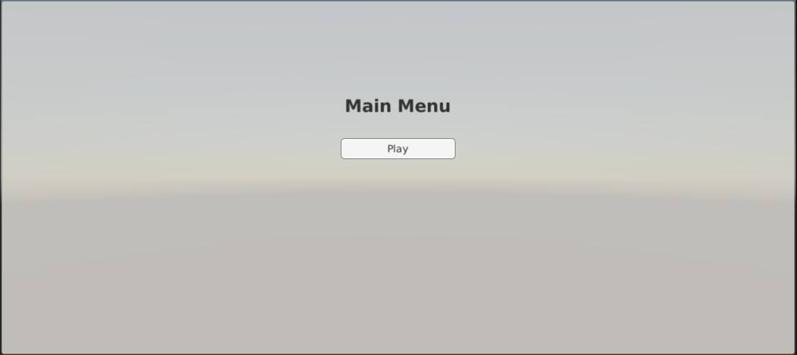
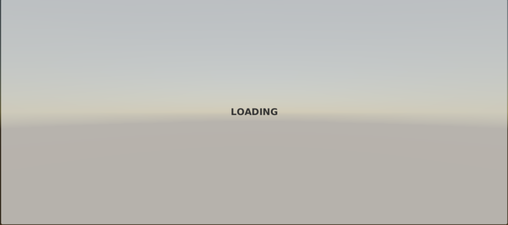
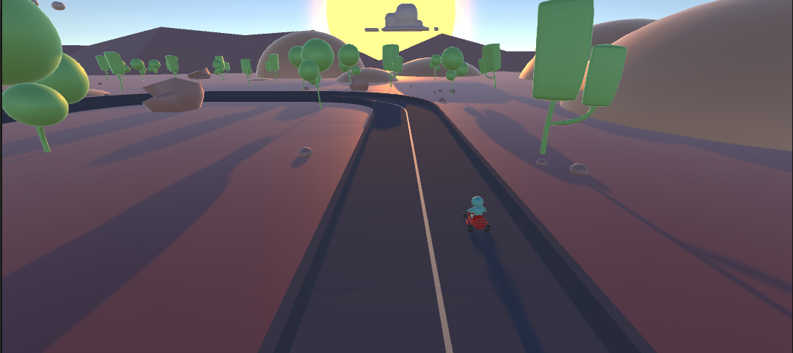
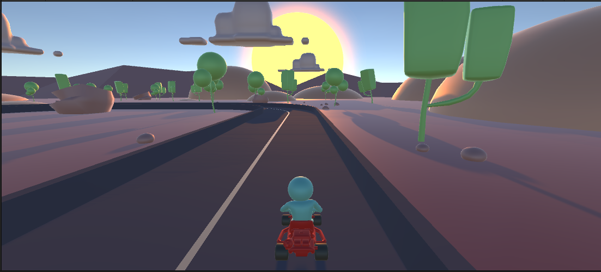

# GetaGamesDevTest
Este es el repositorio para la prueba técnica de desarrollador en Unity.

## Progreso
 1.  Crear una interfaz gráfica que me permita desde una escena “MainMenu” ir
     a una escena de juego “Gameplay” y al terminar el juego volver a la
     escena “MainMenu”. Se
     requiere
     también
     una
     escena
     de
     transición “Loading” entre la escena “MainMenu” - “Gameplay” y viceversa.
     
* Main Menu

  
* Loading

* Gameplay 

  
2. En el “Gameplay” crear un modo de juego en que el jugador controle un Kart
   que se moverá a través de un circuito. Debe cumplir con las
   siguientes características:
   
* Control por teclado del kart.

