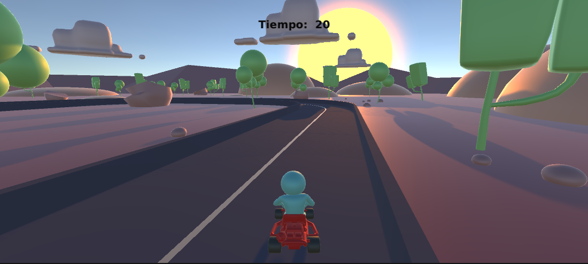
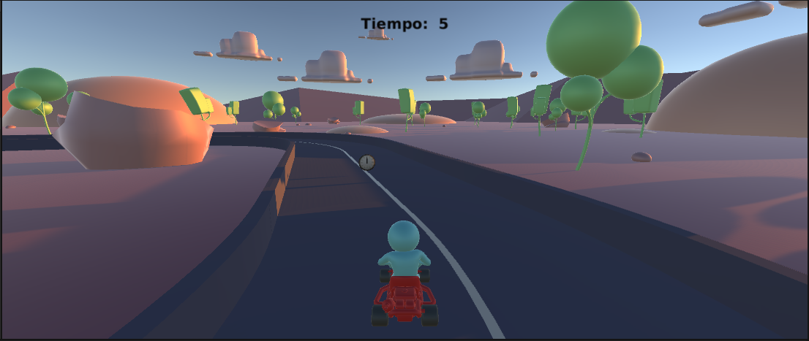
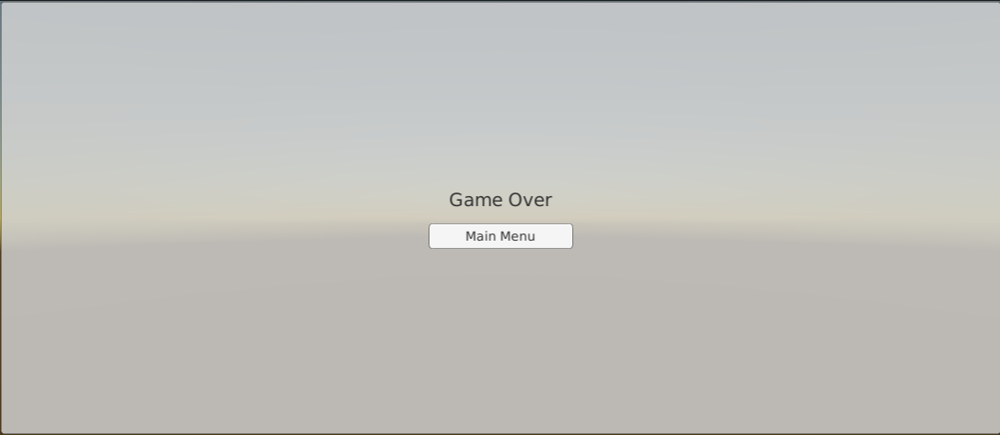
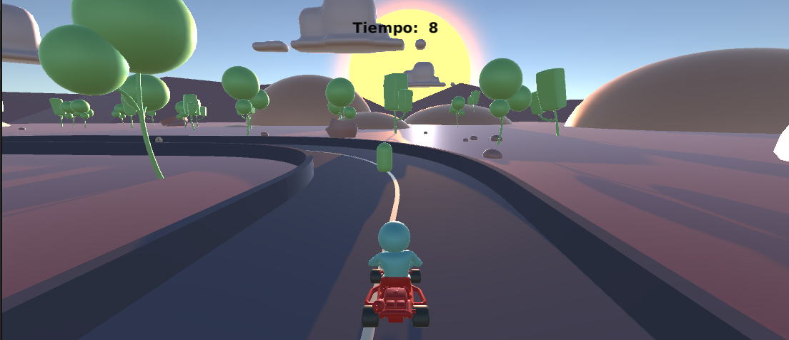
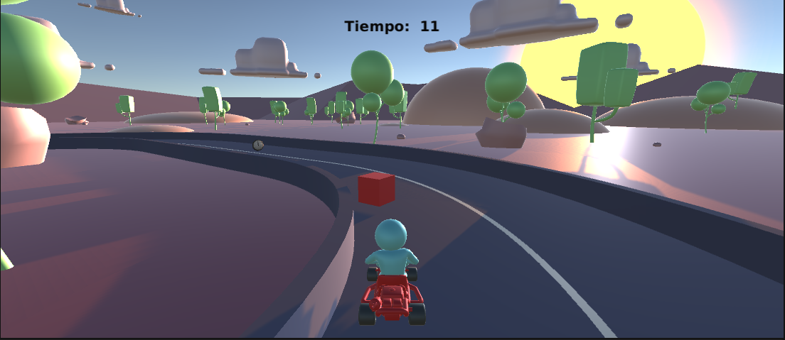
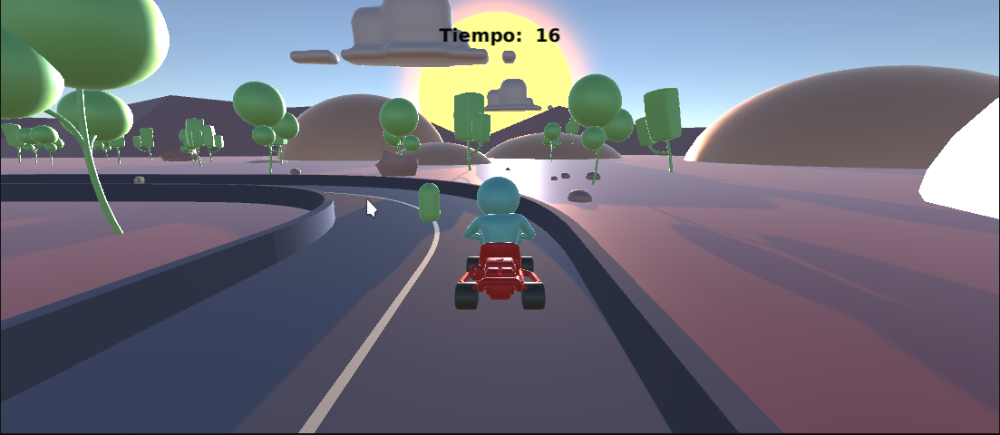
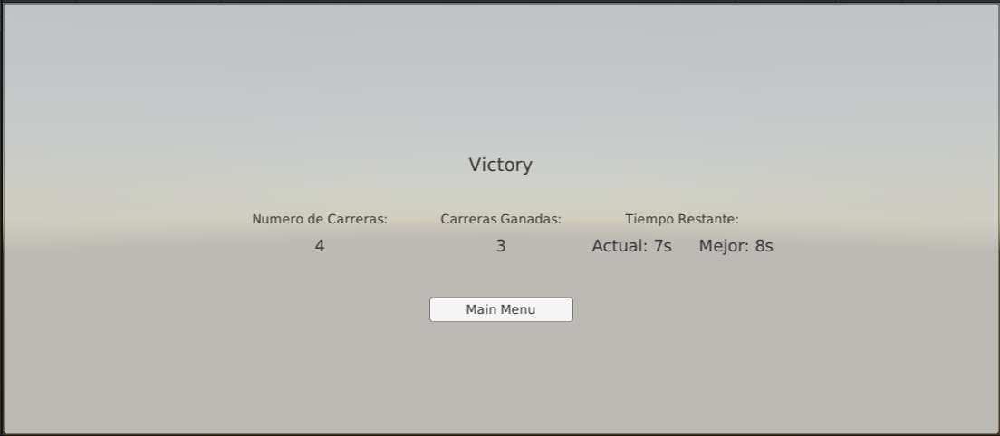

# GetaGamesDevTest
Este es el repositorio para la prueba técnica de desarrollador en Unity.

## Third Party Models:
* [Clock](https://assetstore.unity.com/packages/3d/props/interior/clock-4250)

## Progreso
 1.  Crear una interfaz gráfica que me permita desde una escena “MainMenu” ir
     a una escena de juego “Gameplay” y al terminar el juego volver a la
     escena “MainMenu”. Se
     requiere
     también
     una
     escena
     de
     transición “Loading” entre la escena “MainMenu” - “Gameplay” y viceversa.
     
* Main Menu

  
* Loading

* Gameplay 

  
2. En el “Gameplay” crear un modo de juego en que el jugador controle un Kart
   que se moverá a través de un circuito. Debe cumplir con las
   siguientes características:
   
* Control por teclado del kart.

  
* Tiempo en UI que va decreciendo segundo a segundo.

  
* Distribución de un objeto que al ser tomado por el kart sumará tiempo para
  permitir seguir jugando (El grafico, la distribución, y la cantidad de tiempo y
  de objetos en la pista queda a elección del candidato).
 
  
* El jugador ganará cuando complete una vuelta antes de que el tiempo sea
  cero. Deberá haber algún elemento gráfico o de UI que evidencia el resultado
  del juego (Si ganó o perdió)
  
  
3. Añadir al modo de juego anterior 3 mecánicas de suelo.

* Turbo o aumento de velocidad: Al ser tocado el kart aumentará su velocidad
  durante un corto periodo de tiempo.

  
* Aceite u obstáculo: Al ser tocado el kart pierde el control durante
un corto periodo de tiempo.
  
  
* Salto: Añadir un sistema de salto en la pista.

  
4. Guardar información de la sesión y de estadísticas que va llevando el
   jugador. Por ejemplo, cuantas carreras jugadas, cuantas ganadas, cuál es el
   récord de la vuelta, etc.

